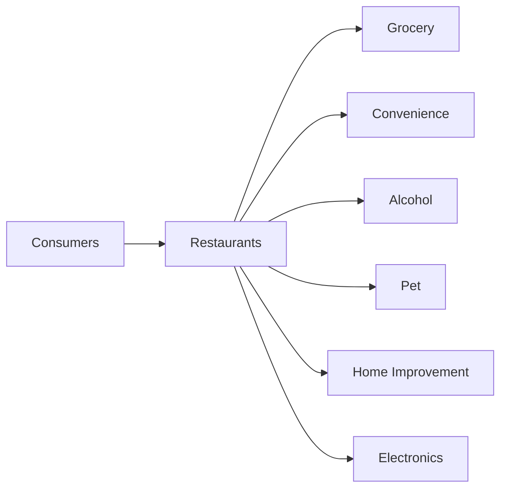
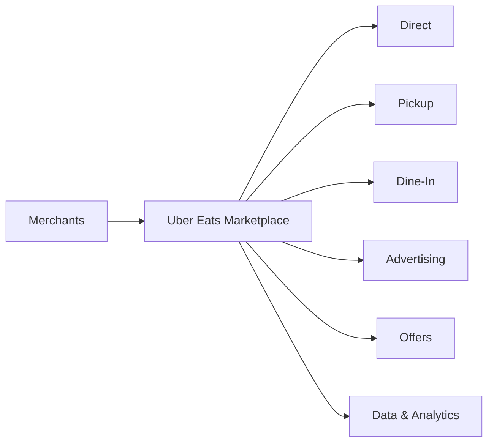

Photograph of an Uber Eats delivery bag with flowers and groceries on a doorstep

May 7, 2025

# Uber Technologies, Inc.
# Q1 2025 Earnings

Supplemental Data

<page_number>1</page_number>

# Uber is best positioned to capitalize on the global on-demand local commerce opportunity

## <u>Market leadership</u>

Global leading delivery player operating in >30 countries

8

Category leading positions in top 10 countries

Australia flag Canada flag Chile flag France flag Japan flag
Mexico flag Spain flag Taiwan flag United Kingdom flag United States flag

## <u>Growth</u>

**$82B** Gross Bookings ARR1
(+18% YoY in Q1’25)2

<table>
  <tbody>
    <tr>
        <td>Period</td>
        <td>Gross Bookings ($B)</td>
    </tr>
    <tr>
        <td>2022</td>
        <td>56</td>
    </tr>
    <tr>
        <td>2023</td>
        <td>63</td>
    </tr>
    <tr>
        <td>2024</td>
        <td>73</td>
    </tr>
    <tr>
        <td>Q1'25 ARR1</td>
        <td>82</td>
    </tr>
  </tbody>
</table>

## <u>Profitability</u>

**$3.1B** Adjusted EBITDA ARR1
(+45% YoY in Q1’25)

<table>
  <tbody>
    <tr>
        <td>Period</td>
        <td>Adj. EBITDA ($B)</td>
        <td>Adj. EBITDA Margin (%)</td>
    </tr>
    <tr>
        <td>2022</td>
        <td>0.6</td>
        <td>1.0</td>
    </tr>
    <tr>
        <td>2023</td>
        <td>1.4</td>
        <td>2.2</td>
    </tr>
    <tr>
        <td>2024</td>
        <td>2.3</td>
        <td>3.2</td>
    </tr>
    <tr>
        <td>Q1'25 ARR1</td>
        <td>3.1</td>
        <td>3.7</td>
    </tr>
  </tbody>
</table>

\*Note 1: Annual run rate.
\*Note 2: Growth rate shown on a constant currency basis.
\*Note 3: Adjusted EBITDA as a % of Gross Bookings.

Uber Q1 2025 Earnings

<page_number>5</page_number>

# Pursuing massive opportunities in local commerce through new products and tech

## Q1 highlights

17% YoY merchant growth

18% of Delivery MAPCs ordering from Grocery & Retail

~$10 billion run-rate Grocery & Retail Gross Bookings

Uber Q1 2025 Earnings

<page_number>6</page_number>