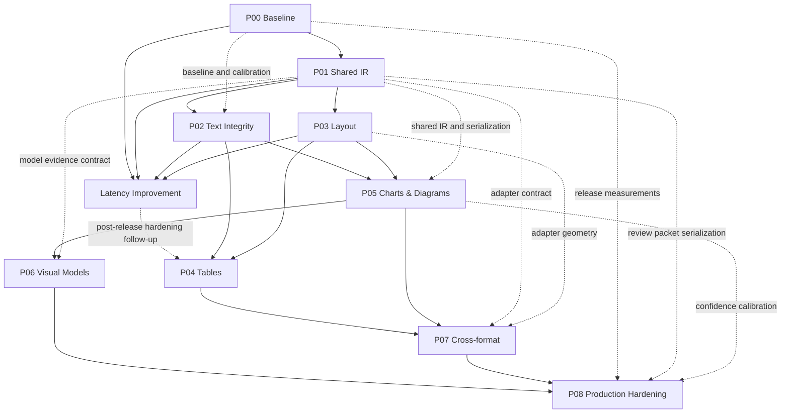

# Dependency Graph and Execution Gates

Status: Phases 0–3 complete; LAT-US01/LAT-US02 administratively Done with recorded deferrals; LAT-US03–LAT-US08 paused; Phases 04–08 resumed for release-first planning  
Source of truth: `roadmap.md` canonical 77-story backlog

Historical latency dependency (2026-08-08): every unfinished Phase 04–08 story consumed
the canonical
[`LlamaParse latency reference v1`](benchmarks/llamaparse-15/latency-reference-v1.md).
No prior local latency benchmark can satisfy Definition of Done or a phase
exit. Comparable input/output, at least five interleaved samples per applicable
case, candidate p50/p95 no greater than paired LlamaParse p50/p95, and unchanged
quality/reliability were blocking dependencies. These validation dependencies
are now deferred by the
[`release-first policy`](release-first-phases-04-08.md); functional production
dependencies in the story graph remain unchanged.

[`phase-latency`](phase-latency/README.md) is paused after LAT-US02. P04-US01
may resume first under its release acceptance criteria; P04-US02/US04/US03 and
later phases still require their functional predecessors.

LAT-US01 is Done only under its exact
[scoped r34 owner exception](phase-latency/decisions/LAT-US01-r34-scoped-owner-exception.md).
Its retained local HWM failure does not propagate as a reusable pass or waiver.
LAT-US02's historical readiness and blocker records remain intact, but the
story was later closed under the requester-directed production-first scope
with deeper validation deferred. LAT-US03 and later remain Proposed and paused.

## Phase-level graph

The solid arrows show the primary delivery flow. Dotted arrows show direct
cross-phase contracts that are not obvious from the primary flow; the complete
story-level graph below remains authoritative.



## Complete story-level dependency chains

Each non-root story appears exactly once as the right-hand side of a dependency
expression. Every left-hand story is a required predecessor from the canonical
roadmap, not merely a related story.

```text
# Phase 00 — Baseline
P00-US01 (root)
P00-US01 -> P00-US02
P00-US02 -> P00-US03
P00-US01 + P00-US02 -> P00-US04
P00-US04 -> P00-US05
P00-US05 -> P00-US06
P00-US06 -> P00-US07
P00-US07 -> P00-US08
P00-US08 -> P00-US09
P00-US03 + P00-US09 -> P00-US10

# Phase 01 — Shared IR
P00-US10 -> P01-US01
P01-US01 -> P01-US02
P01-US02 -> P01-US03
P01-US03 -> P01-US04

# Phase 02 — Text Integrity
P01-US02 -> P02-US01
P02-US01 -> P02-US02
P02-US02 -> P02-US03
P02-US03 -> P02-US04
P00-US03 -> P02-US05
P02-US04 + P02-US05 -> P02-US06

# Phase 03 — Layout
P01-US02 -> P03-US01
P01-US02 + P03-US01 -> P03-US02
P03-US01 + P03-US02 -> P03-US03
P03-US03 + P01-US03 -> P03-US04
P01-US02 + P03-US04 -> P03-US05
P01-US02 + P03-US04 -> P03-US06
P01-US02 + P03-US04 -> P03-US07
P01-US03 + P03-US04 -> P03-US08

# Phase 04 — Tables
P03-US01 -> P04-US01
P04-US01 + P02-US04 -> P04-US02
P04-US02 + P03-US06 -> P04-US04
P04-US02 + P04-US04 + P03-US04 -> P04-US03

# Phase Latency — paused; remaining work moves to post-release hardening
P00-US10 + P01-US04 + P02-US06 + P03-US08 -> LAT-US01
LAT-US01 -> LAT-US02
LAT-US02 -> LAT-US03
LAT-US03 -> LAT-US04
LAT-US04 -> LAT-US05
LAT-US05 -> LAT-US06
LAT-US06 -> LAT-US07
LAT-US07 -> LAT-US08

# Phase 05 — Charts & Diagrams
P01-US02 + P03-US04 -> P05-US01
P05-US01 -> P05-US02
P05-US02 + P02-US06 -> P05-US03
P05-US03 -> P05-US04
P05-US04 + P01-US04 -> P05-US05
P05-US01 + P02-US06 -> P05-US06
P05-US06 + P05-US05 -> P05-US07
P05-US06 + P05-US05 -> P05-US08
P05-US07 + P05-US08 + P05-US05 -> P05-US09
P05-US01 + P03-US04 -> P05-US10

# Phase 06 — Visual Models
P05-US01 -> P06-US01
P06-US01 -> P06-US02
P06-US01 -> P06-US03
P06-US02 + P06-US03 + P05-US09 + P05-US10 -> P06-US04
P06-US04 + P05-US05 -> P06-US05
P06-US05 + P01-US04 -> P06-US06

# Phase 07 — Cross-format
P01-US04 + P03-US04 -> P07-US01
P07-US01 + P05-US09 + P05-US10 -> P07-US02
P07-US01 -> P07-US03
P07-US01 + P07-US03 + P04-US02 -> P07-US04
P07-US01 + P07-US03 + P03-US04 -> P07-US05
P07-US01 + P07-US03 + P04-US02 -> P07-US06
P07-US05 + P07-US06 + P05-US05 -> P07-US07
P07-US02 + P07-US04 + P07-US05 + P07-US06 + P07-US07 -> P07-US08
P07-US08 -> P07-US09

# Phase 08 — Production Hardening
P07-US09 -> P08-US01
P08-US01 -> P08-US02
P08-US02 -> P08-US03
P08-US02 + P06-US06 -> P08-US04
P08-US03 + P08-US04 + P00-US03 -> P08-US05
P08-US03 + P08-US04 + P06-US06 + P05-US05 -> P08-US06
P08-US05 + P08-US06 + P01-US04 -> P08-US07
P08-US03 + P07-US09 -> P08-US08
P08-US08 + P06-US06 -> P08-US09
P08-US04 + P08-US07 + P08-US08 + P08-US09 -> P08-US10
P08-US10 -> P08-US11
P08-US11 -> P08-US12
```

## Release-first gate inheritance for Phases 04–08

The following section supersedes the older exhaustive gate inheritance for the
current release only. A Phase 04–08 story needs its listed functional
predecessors, completed production code, focused behavior tests, one
representative end-to-end flow, compatibility, ordinary safe failure, and
rollback. Benchmark campaigns, latency/RSS/CPU/process-lineage accounting,
adversarial matrices, extensive evidence custody, and environment-specific
proof are deferred under
[`release-first-phases-04-08.md`](release-first-phases-04-08.md).

Safety behavior intrinsic to a feature remains mandatory, especially OOXML
path/XML bounds, non-execution of macros/formulas, hosted deny-by-default
policy, and bounded requests. Dependencies may be worked in parallel only when
they do not consume unfinished contracts; integration stories still wait for
their functional predecessors.

## Historical gate inheritance

Every story inherits all of the following gates:

1. all listed predecessor stories are Done, with completion reports and
   rollback evidence where applicable;
2. the story meets the Definition of Ready, including explicit scope/non-scope,
   approved fixtures, measurable acceptance, planned tests, schema impact,
   metrics, feature flag, and rollback;
3. its dedicated unit, integration, fixture, negative, contract,
   serialization, configuration, cross-format, performance, and regression
   tests pass where applicable;
4. its phase regression and every completed earlier-phase regression pass;
5. public API, schema, canonical serializer, and legacy-projection compatibility
   pass;
6. unchanged fixtures show no unexplained regression or unsupported content;
7. before/after quality, latency, resource, escalation, and cost metrics are
   recorded as applicable;
8. the tracker and completion evidence are updated before the story is marked
   Done;
9. the next story is not started without explicit approval.

A Proposed or In-Progress predecessor does not satisfy a dependency. A later
phase cannot waive an earlier failed gate. Any exception requires a decision
record with owner, scope, justification, expiry, affected fixtures/consumers,
rollback, and explicit approval.

Feature flags are rollback boundaries, not substitutes for acceptance. A
default-off implementation must still pass flag-off parity and its enabled-path
story tests before it can be marked Done.

## Cross-cutting dependencies

| Dependency | Stories affected | Required decision or prerequisite |
|---|---|---|
| Source fixture rights and custody | P00-US04 onward | Complete: the catastrophe triplet was approved under P00-US02, and on 2026-07-29 the requester confirmed that all remaining 14 PDF/Markdown/JSON triplets and derived annotations are public and redistributable with no exceptions. |
| P00-US04 finite scope | P00-US04–P00-US10 | Resolved: the requester approved the 3/3/5/5/5/5/5-point portable-registry, claim-contract, three claim-batch, control-registry, and runner sequence with finite 15/30/45, corrected 210-claim, and 25-gap/109-row denominators. |
| Benchmark and metric contract | P00-US01, P00-US03–US10, all behavior stories, P08-US05–US10 | Pin reviewed truth classes, expert inclusion masks, tolerances, reference hardware, aggregation, and report format before accepting before/after claims. |
| Phase Latency paired comparator and P03 continuity | LAT-US01–LAT-US08 | Use only cache-disabled paired LlamaParse p50/p95 per case; preserve exact P03-US08 attempt 48, ceilings, maximum 5% candidate-specific bound, default-off rollback, all non-waived gates, review by 2026-09-02, and expiry before production or a relevant protected running-region change. |
| Public schema evolution | P01-US01–US04, P05-US01/P05-US05, P06-US01/P06-US06, P07-US01/P07-US09 | Decide additive v1 fields versus a future schema version; preserve the legacy projection until explicitly retired. |
| Canonical serialization ownership | P01-US03/US04, P03-US04–US08, P04, P05-US05, P06-US06, P07, P08-US07 | Backend JSON/Markdown/text is canonical; clients must not reinterpret format-specific elements independently. |
| Feature-flag registry | All behavior-changing stories; consolidated by P08-US01 | Define naming, defaults, scopes, ownership, dependencies, emergency disable behavior, and retirement policy. |
| Font parser dependency | P02-US01/US02 and Phase 02 exit | Resolved for Phase 02 with existing PDF primitives and no new package or runtime download; source alignment remains default off with one-flag rollback. Any future parser still requires security, license, size, and performance review. |
| OCR engines and language assets | P02-US03–US06, P05-US06–US09, P07 fallback | P02-US03 resolved: local Tesseract 5.5.3 plus hash-bound English trained data (`7d4322bd…70b2`), Apache-2.0, no runtime download, deterministic unavailable/timeout behavior, and default-off rollback. Later stories inherit this binding unless a separately approved decision changes it. |
| Optional classifier/model artifacts | P05-US01, P06-US01–US06 | Core fallback must work without artifacts. Record model hash, source, license, hardware, and unavailable behavior before enablement. |
| Raster CV libraries and budgets | P05-US06–US09 | Approve dependency/license footprint, pixel and crop bounds, reference CPU/RAM, and direct-image/PDF parity tolerances. |
| Hosted processing permission | P06-US03–US06, P08-US04, P08-US09/US10 | Approve data classes, vendors/models, regions, retention, subprocessors, redaction, budgets, credentials, and deny-by-default policy. |
| Office package security and libraries | P07-US03–US09 | Approve OOXML libraries/converters, archive and relationship limits, sandboxing, external-link policy, update cadence, and licenses. |
| Cross-format semantic twins | P07-US01/US02/US08/US09 | Acquire approved direct-image, image-only-PDF, embedded-image, scanned, DOCX, PPTX, and XLSX twins with common reviewed annotations; M5 cannot pass without them. |
| Native Office chart precedence | P07-US05–US08, P05-US05 | Define embedded workbook versus cached/chart-render evidence precedence and conflict concerns; never silently replace native evidence. |
| Telemetry privacy and exporter isolation | P08-US02–US04 | Define allowed labels/cardinality, redaction, retention, exporter failure isolation, and prohibition on document payloads/secrets. |
| Review operations | P08-US05–US07 | Assign owners, queues, service levels, budgets, decision outcomes, and feedback boundaries before review routing can ship. |
| Artifact/license manifest ownership | P06-US02/US03, P07-US03–US09, P08-US08–US10 | Assign the approver and immutable manifest fields for code, native tools, models, prompts, schemas, and licenses. |
| Canary and rollback environment | P08-US03–US12 | Pin candidate/control versions, traffic/fixture mix, thresholds, observability, failure injection, authority, and reference infrastructure. |

## Known risks and open questions

| Topic | Risk or question | Planning stance until resolved |
|---|---|---|
| Benchmark custody | Resolved: all 15 source/expert triplets and derived annotations are public and redistributable with no exceptions. | Apply the approved workspace, repository, benchmark, and CI boundaries recorded in `phase-00-baseline/decisions/P00-US04-corpus-custody.md`; no private or synthetic custody substitute is required. |
| Benchmark truth | The expert output contains source-reading errors and values not literally present in the PDF. Which claims are authoritative? | Treat the source artifact and declared evidence class as authoritative. Preserve benchmark disagreements instead of forcing output to match them. |
| Cross-format coverage | The 15-case corpus has only native-text PDFs and no direct-image, fully scanned, or Office semantic twins. | M5 and affected P07 Definition-of-Ready gates remain blocked until approved twins with common annotations exist. |
| Compatibility policy | Can additive evidence, relationship, chart, model, and adapter fields remain in public v1? | Default to optional, additive, versioned fields and unchanged legacy projections; require a decision record for any breaking version. |
| Feature-flag ownership | Which registry, scope hierarchy, and retirement process governs parser flags? | Keep behavior default-off with narrow rollback until P08-US01 establishes the auditable registry. Phase 02 source alignment follows this rule and rolls back by setting `PARSER_TEXT_INTEGRITY_SOURCE_ALIGNMENT_ENABLED=false`. |
| Font repair safety | Can low-level CMap recovery be trusted for fonts beyond the identity-mapped fixture? | Require positive embedded-font evidence, negative controls, retained alternatives, and OCR/concern fallback; never repair by language plausibility alone. |
| Raster chart scope | Which chart families and quality levels are contractually supported? | P05-US06–US09 support only their declared raster structures, vertical linear bars, and simple 2-D linear lines. Everything else remains explicit fallback. |
| Derived numeric precision | What tolerance should consumers apply to vector- or raster-measured chart values? | Emit raw measurement, method, calibration, and tolerance. Do not claim hidden exact source data or silently round away uncertainty. |
| Optional model artifacts | May local weights be bundled or downloaded at runtime? | P06-US02 remains optional and no-runtime-download by default. Record artifact/version/hash/license and deterministic unavailable behavior before approval. |
| Hosted visual processing | Which document classes, regions, vendors, retention terms, and locations are allowed? | Deny by default. P06-US03 and P08-US09 require approved policies and mock/no-network contract tests before readiness. |
| Model grounding | Does a valid citation prove a model interpretation is correct? | No. P06-US05 must apply geometry and Phase 05 validators; rejected observations remain evidence/concerns and cannot overwrite source truth. |
| Office-format fidelity | What native versus rendered fidelity is promised for DOCX, PPTX, and XLSX? | Prefer native package evidence, represent unavailable geometry honestly, and use sandboxed bounded fallback only under P07-US08. |
| Office visibility | How are hidden slides/sheets/rows, notes, tracked changes, formula caches, and external links handled? | Each adapter must publish and test an explicit visibility policy; external content is never fetched implicitly. |
| Confidence semantics | Is confidence a probability, rule score, or review priority? | Do not expose calibrated-probability semantics until P08-US05 and P08-US06 validate them separately by artifact/evidence class. |
| Telemetry confidentiality | Can useful quality and cost metrics be collected without document content or high-cardinality identifiers? | P08-US02 must prove payload/secret exclusion and exporter isolation before later instrumentation is enabled. |
| Review feedback | May reviewer decisions alter deterministic truth or train models automatically? | P08-US07 creates grounded review packets and records outcomes; no automatic truth overwrite or training reuse without a separate approved policy. |
| Performance budgets | What hardware, concurrency, fixture mix, and percentile define acceptable latency/RSS/GPU/cost? | P00 defines measurement; P08-US03/US04 instrument it; P08-US10 cannot set a release gate until the environment and owners are approved. |
| Artifact and license approval | Who approves package/model/tool licenses and how are transitive changes detected? | P08-US08 produces the versioned manifest; unresolved or incompatible items block P08-US10 promotion. |
| Rollback granularity | Must rollback be per capability, format, tenant, model adapter, or deployment? | Stories use the narrowest practical flag. P08-US01 centralizes dependencies and P08-US11/US12 prove the operational procedure. |
| Unsupported content | Should an unsupported artifact be omitted, returned opaquely, modeled, or reviewed? | Preserve a grounded fallback with concerns. Model/review escalation is policy-controlled and must never fabricate structure to avoid omission. |

## Release boundaries

Current dependency boundary: Phase 02 is complete at 6 stories/25 points. Its
final 15/15 enabled/predecessor screen passed all affected targets, control
parity, approved owner drift, and performance gates without adding a dependency.
Phase 03 is complete at 8/8 stories and 38/38 points.
P03-US01–P03-US07 are Done with retained exact caption, relationship,
source-note, reading-order, bbox-ownership, text-run/redline, form/key-value,
and outline/list evidence. The P03-US04 edge to P03-US05–P03-US08 and the
P03-US06 edge to P04-US04 are satisfied; P03-US07 and P03-US08 were each
re-estimated 3→5 at readiness. P03-US08 is Done only with the approved active
[frontend bbox compatibility renewal](phase-03-layout/decisions/P03-US08-frontend-bbox-latency-exception-renewal.md);
the strict final is absent, attempt 48 remains failed, the complete companion
remains quarantined, and RSS is not waived. Failed history is sealed through
attempt 55 by manifest
`bca401f2207619ba84422e020104b9a609e0be0f4dc2b42f3ae4fb53d315ceff`.
Review is due no later than 2026-09-02. The operative exception expires before
production enablement or any relevant running-region semantic/runtime/custody
change; unrelated default-off Phase 04 table work admitted by its closed
classifier does not relabel attempt 48 or create a strict pass. The P03-US01
edge to P04-US01 is satisfied. The requester explicitly
authorized Phase 04 on 2026-08-03 under
[the Phase 04 authorization decision](decisions/2026-08-03-phase-04-authorization.md).
P04-US01 independently passed Definition of Ready 10/10 and entered In Progress
on 2026-08-04. On 2026-08-08, the requester authorized Phase Latency as the
sole active workstream at that historical checkpoint. P04-US01 therefore
returned to **Ready — execution paused** without changing its readiness or
evidence. LAT-US01 later completed
under its exact scoped r34 exception. On 2026-08-10 LAT-US02 received separate
requester confirmation, passed Definition of Ready 10/10, and became the sole
In Progress story. LAT-US03–LAT-US08 and every other Phase 04 story remain
Proposed. The story-by-story boundary still requires explicit requester
confirmation before each later latency successor. LAT-US02's owner-directed
numerical RSS deferral is non-transferable and does not alter the exact
latency-continuity renewal or any later/phase-exit gate.
Its [blocked handoff](phase-latency/reports/LAT-US02-blocked-handoff.md) records
zero campaign/hosted use and the separate architecture authority that would
have been required to resume that campaign. The 2026-08-10 release-first policy
now pauses latency successors and permits Phase 04–08 delivery in functional
dependency order.
Totals through Phase 03 remain 28 stories and 127 points; the canonical planned
portfolio is 77 stories and 362 points.

Hardened superseding renewal (2026-08-03): that custody prerequisite is
resolved only for the exact default-off Phase 04 table surfaces admitted by
[`P03-US08-LATENCY-EXCEPTION-RENEWAL-20260803-PHASE04-TABLES-HARDENED`](phase-03-layout/decisions/P03-US08-phase04-tables-latency-exception-hardened-renewal.md)
and its
[executable record](phase-03-layout/evidence/P03-US08-phase04-tables-latency-waiver-hardened-renewal.json),
with final approval bound in
[the independent approval record](phase-03-layout/evidence/P03-US08-phase04-tables-hardened-renewal-independent-approval.md).
The earlier frontend renewal and its 86-path manifest remain immutable
historical baseline evidence, not a current strict-artifact pass. Attempt 48
remains failed at **0.050946750 seconds** versus the unchanged
**0.050000000-second** New York projection-p95 ceiling (**0.000946750 seconds /
1.8935%**, maximum **5%** candidate-specific); the companion remains
quarantined and strict-final evidence remains absent. Changes structurally
sealed inside the authorized Phase 04 table-only scope, including completing
Phase 04 within that scope, do not trigger the old blanket expiry. Any scope
expansion or protected running-region semantic, runtime, or custody change
requires a new explicit decision and expires the renewal before the change;
production enablement remains prohibited and review is due no later than
**2026-09-02**. Default-off rollback and all non-waived RSS, paired/source/Uber
latency, correctness, security, compatibility, custody, resource, output,
rollback, and hosted-use gates remain dependencies.

Operative administrative continuity renewal (2026-08-07): the requester's
current authority is recorded in
[`P03-US08-LATENCY-EXCEPTION-RENEWAL-20260807-PHASE04-TABLES-ADMINISTRATIVE-CONTINUITY`](phase-03-layout/decisions/P03-US08-phase04-tables-latency-exception-operative-administrative-renewal.md)
and its
[machine-readable classifier](phase-03-layout/evidence/P03-US08-phase04-tables-latency-waiver-operative-administrative-renewal.json).
It is operative only for development, testing, evidence, review, and
documentation that is semantically unrelated to P03 and default-off within the
four authorized Phase 04 table stories. It deliberately does not bind volatile
Phase 04 implementation hashes or authorize story completion, Phase 04 exit,
production, hosted use, or Phase 05. Any relevant running-region semantic,
runtime, custody, metrics, dependency, ceiling, rollback, or non-waived-gate
change expires it before reliance. Attempt 48, all ceilings, the maximum 5%
candidate-specific bound, strict-final absence, default-off rollback, and the
attempt-55 sealed manifest remain unchanged. The immutable
[review request](phase-03-layout/evidence/P03-US08-phase04-tables-operative-administrative-renewal-independent-review-request.md)
is now closed by the exact-bundle
[independent approval](phase-03-layout/evidence/P03-US08-phase04-tables-operative-administrative-renewal-independent-review.md).
That approval covers only the administrative classifier; exact final-code,
story, production/security, metrics/custody, and Phase 04 exit reviews remain
mandatory.

- **M0 foundation evidence gate:** P00-US01–US10 and phase 01 are complete;
  the reviewed 15-case benchmark, immutable runner, IR,
  provenance, relationships, and canonical serialization are reproducible.
- **M1–M4 local-core release candidate:** phases 00–05 are complete. Vector, raster,
  table, layout, and text behavior pass their gates; Phase 06 remains disabled.
- **Optional-model release candidate:** phase 06 is complete, local/hosted
  adapters remain default-off, and deterministic fallback passes every failure
  mode.
- **M5 cross-format release candidate:** phase 07 is complete for each individually
  enabled adapter; unsupported adapters remain unadvertised, and native/visual
  reconciliation and conformance gates pass. This boundary is currently blocked
  by the missing semantic-twin fixtures.
- **M6 production candidate:** P08-US01–US10 are complete; telemetry, calibration,
  review, artifact/license, privacy, and blocking canary gates all pass.
- **Production release:** P08-US11 and P08-US12 are complete, the failure and
  rollback drill passes on the approved environment, and an authorized owner
  explicitly approves release.

Crossing a release boundary does not authorize implementation of the next
story. The one-story-at-a-time approval gate still applies.
